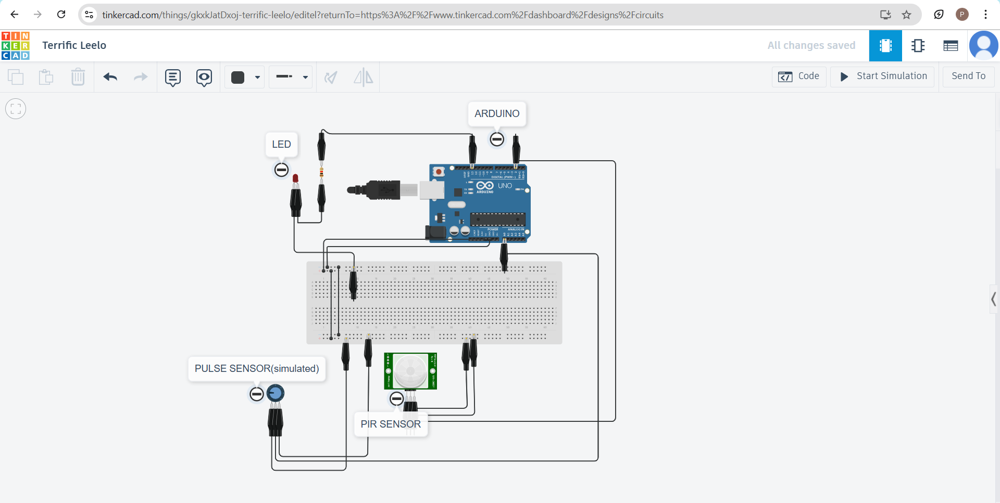
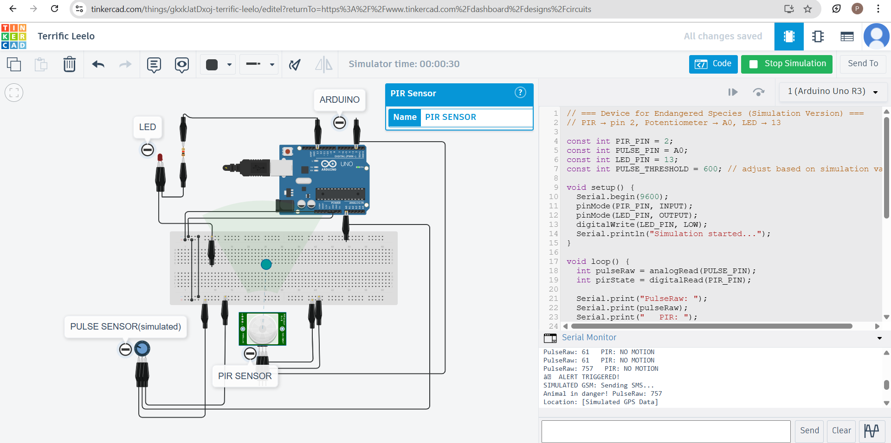

# Device for Endangered Species 🐾
#Tinkercad based 

A low-cost smart collar simulation for monitoring endangered animals using Arduino Uno, PIR sensor, and pulse sensor (simulated with potentiometer).

---

## 📂 Files in this Repo
- `project.ino` → Arduino sketch (Tinkercad/Arduino IDE code).
- `circuit.png` → Circuit wiring screenshot from Tinkercad.
- `output.png` → Serial Monitor output showing alert.
- `demo.mp4` → Short demo video of simulation running.
- `presentation.pptx` → Project presentation slides.

---

## ⚡ How It Works
1. **Inputs:** Pulse sensor (via potentiometer) and PIR sensor send data to Arduino.
2. **Processing:** Arduino checks values vs thresholds.
3. **Outputs:** If abnormal → LED lights + Serial Monitor prints simulated SMS & GPS.
4. In real hardware, GSM sends actual SMS and GPS gives live location.

---

## ▶️ How to Run Simulation
1. Open [Tinkercad Circuits](https://www.tinkercad.com/circuits).
2. Build the circuit (Arduino + PIR + potentiometer + LED).
3. Paste code from `project.ino`.
4. Start simulation → open Serial Monitor → trigger PIR or rotate potentiometer.

---

## 📸 Demo
Circuit design:  

Serial Monitor Output:  

🎥 Demo Video: [demo.mp4](demo.mp4)

---

## 🚀 Future Scope
- Replace simulated GPS/GSM with real modules.  
- Add solar charging for outdoor deployments.  
- Use AI/ML to predict abnormal animal behavior.

---
## My Hardware of this Project contains :
-Real Time GPS Module and GSM
